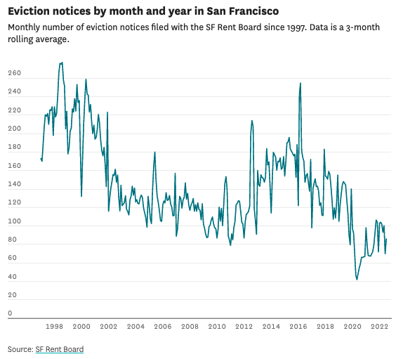

## A guide to making auto-updating charts using R and Datawrapper



#### **Why would you want to do this (and when would we do it in R rather than Google sheets)?**

-   Google sheets is a great tool for auto-updating charts and it will be a good resource for many types of auto-charts you want to do.

-   R might be a better choice than Sheets for auto-updating big datasets

-   You can also use R to make your auto-updating charts replicable for others

-   Setting up a cron job makes the process totally automatic, as long as your laptop is on at the time you specify your script to run

#### What you will need

-   An API/download link for the data you want (in my case, it's [Eviction Notices filed with the SF Rent Board](https://data.sfgov.org/Housing-and-Buildings/Eviction-Notices/5cei-gny5))

-   RStudio and R

-   Access to Datawrapper and the Internet

#### How to make a Datawrapper chart in R

Download DatawrappR, the R library we will be working with, and create your API key in Datawrapper. To install DatawrappR, [follow the instructions here.](https://munichrocker.github.io/DatawRappr/)

To generate your API key in Datawrapper, follow the [Datawrapper guide here](https://developer.datawrapper.de/docs/getting-started#authentication). Make sure you check all the necessary scopes in Datawrapper when you create your API key; you might not want to check the "team" read and write scopes, or the "user" write scope, but I suggest checking the rest.

Check that your API is functioning in the command line and/or your R console.

Command line:

```{bash}
curl --request GET \
  --url https://api.datawrapper.de/v3/me \
  --header "Authorization: Bearer YOUR_TOKEN_HERE"
```

RStudio console:

```{r}
dw_test_key()
```

If one or both of these don't work, you may have not enabled the right scopes, or you may have entered your API key incorrectly. But if they do work, you should get responses with information about your user/account.

DatawrappR has a lot of cool functions you can learn about by [clicking here](https://github.com/munichrocker/DatawRappr). The main ones we will be using are `dw_create_chart()`, `dw_data_to_chart()`, `dw_edit_chart()` and `dw_publish_chart()`.

You can learn more about these functions and how to use them by typing `?function_name()` into your console.

#### **Setting up your data**

Read in your updating data using a link or API. I'll be using the Socrata Open Data API (SODA) to read in Eviction Notices filed with the [San Francisco Rent Board](https://data.sfgov.org/Housing-and-Buildings/Eviction-Notices/5cei-gny5).

Once you've read in your data, you will want to create a new dataframe with only the columns and values you want to chart. In my case, I created a chart of monthly eviction filings from SF's eviction notices with the following code:

```{r}
#create new table
eviction_notices_for_DW <- eviction_notices %>%
#group by year and month
  group_by(year, month) %>%
#calculate the number of filings per month
  summarize(count_year_month = n()) %>%
#create a new column that’s a three-month average of monthly eviction filings, for a smoother line
  mutate(x3monthavg = rollmean(count_year_month, 3, na.fill(count_year_month, c("extend", NA)))) %>%
#create a day column and concatenate the date columns into one; convert the date column to date type
  mutate(day = 1, date = paste(year,month,day, sep = "-", date = as.Date(date, format = "%Y-%m-%d")) %>%
#select only the columns we need
  select(date, x3monthavg)
```

You then use the Datawrapper function `dw_create_chart` like so:

```{r}
chart_name_in_r <- dw_create_chart(title = "Chart title", type = "chart_type")
```

Mine looks like this:

```{r}
eviction_notices_by_year_month_chart <- dw_create_chart(title = "Eviction notices by month and year", type = "d3-lines")
```

I used a line chart, but the API allows you to access multiple types of charts. You can use the ?dw_create_chart command to access the names for each chart type that R will recognize.

Once you create the chart, you should put a \# in front of this part of the script to hide it - otherwise each time you run the script you'll create a new chart! Not the way to do this.

The command should yield a short code that looks something like this: wRU6m

You will need this code, which is Datawrapper's code for the unique chart, for the other commands.

Ok, now we have our data in a chart-able format and we have an empty Datawrapper chart. Let us join them!

We will do this using the dw_data_to_chart() function like so:

```{r}
dw_data_to_chart(dataframe_name, "chartcode")
```

For me that looks like:

```{r}
dw_data_to_chart(eviction_notices_for_DW, "wRU6m")
```

This leads us to a simple chart, but what if we want to edit the chatter, source, source link and folder ID?

```{r}
dw_edit_chart(title = NEWTITLE", intro = "Intro text here!", 
              source = "Source name", source_url = https://sourcelink.com", 
              chart_id = "chartcode", folderId = "foldercode"
              )
```

You can find the folder ID by navigating to your own personal folder in Datawrapper and copying the final text/number string in the web address path. Ex: <https://app.datawrapper.de/archive/team/foldercode>

Now all that's left is to publish the chart.

```{r}
dw_publish_chart("chartcode")
```

That's it! You can make any additional formatting edits in Datawrapper's interface, and those will stick around as long as you don't edit them from your script.

Now, if you want to go into RStudio and run this script manually every day, that's fine. But what if you just want this to hum along merrily in the background as you move onto new exciting projects

This is where our friend the cron job comes in, with its buddy the command line.

#### How to make your chart auto-updating

Open the terminal.

Type in crontab -e

Type I, for insert. This will allow you to edit your crontab.

This [guide to cron jobs](https://www.hostinger.com/tutorials/cron-job) is great for understanding the basic mechanism and how to use the five asterisks to specify the intervals at which you want to update your data. Read the guide and then come back here!

Basically you are going to write something that fills in the below:

```{bash}
#description of the cron job you’re running
* * * * * /usr/local/bin/Rscript <your unique filepath>

This is what mine looks like:
#eviction tracking script
02 12 * * * /usr/local/bin/Rscript /Users/sneilson/cron_jobs/evictions_tracking.R
```

(Note 1: Find the full path of your file by right-clicking the script, holding down the option key, and clicking `copy <filename> as Pathname`)

(Note: your Rscript path might not look exactly like this: `/usr/local/bin/Rscript`. If so, you will have to locate it yourself. I found this guide very helpful for doing that, along with generally integrating cron and R.)

Once you have set up the time you want your cron job to run, and put your filepath and the location of R in there, then you can type in `control + c` to exit insert mode, and then type in `:wq` to exit the crontab entirely.

#### Voila! 

Your chart should auto-update, but you can check by first setting your crontab to work minutes after you set it up.

One caveat: Your computer will need to be on at the time you've scheduled your script to run. If it misses one day, it will update the following day.

---
title: "Susie's guide to making auto-updating charts using Datawrapper and R"
author: "Susie Neilson"
date: '2022-08-12'
output: html_document
---

